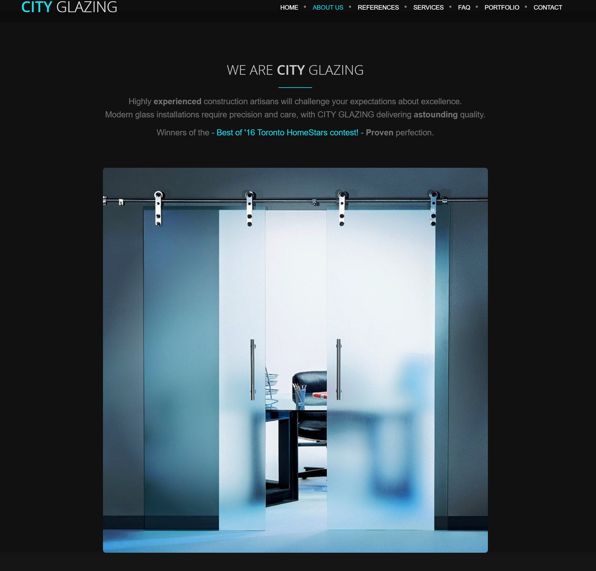

# City Glazing Website

This repository contains the source code for the City Glazing company website, a stunning and dynamic online presence showcasing their glass services in Toronto, Canada.

Completed City Glazing website. Fully functional, responsive, and visually polished. Built with HTML5, CSS3, Bootstrap, JavaScript, jQuery, AJAX, Revolution Slider, Owl Carousel, and Cube Portfolio. Ready for deployment.

## Description

The City Glazing website was built to provide a modern, user-friendly experience for potential clients. It features:

*   **Dynamic Content:**  AJAX-enabled interactions for a smooth and engaging browsing experience.
*   **Mobile-Friendly Design:** Responsive layout built with Bootstrap, ensuring optimal viewing across all devices.
*   **Visually Appealing:**  Employs a clean and modern design with high-quality images to showcase City Glazing's work.
*   **Engaging Features:** Includes a Revolution Slider, Owl Carousel for testimonials and client logos, and a Cube Portfolio for project displays.
*   **SEO Optimized:** Built with consideration for search engine optimization to improve online visibility.
*   **Contact Focused:**  Clear call-to-actions and an easy-to-use contact form to encourage inquiries.
*   **Homestars Integration:** Showcases positive reviews and awards from HomeStars to build trust and credibility.

## Technologies Used

*   **HTML5:**  Semantic markup for structure and content.
*   **CSS3:**  Styling, including custom CSS and pre-built styles from Bootstrap and other plugins.
*   **JavaScript:**  For dynamic interactions, animations, and form handling.
*   **jQuery:**  JavaScript library for DOM manipulation and event handling.
*   **Bootstrap:**  Front-end framework for responsive design and pre-built components.
*   **AJAX:**  For asynchronous data loading and updating parts of the page without full reloads.
*   **Revolution Slider:**  For creating visually engaging image sliders on the homepage.
*   **Owl Carousel:**  For displaying testimonials and client logos in a carousel format.
*   **Cube Portfolio:**  For presenting the company's portfolio in a dynamic and interactive grid.
*   **Font Awesome:**  For scalable vector icons.
*   **Line Icons:** For a clean and consistent icon set.
*   **Pace.js:**  For an automatic page load progress bar.
*   **PHP:** Used in the included `assets/php/sky-forms-pro/demo-contacts-process.php` for the contact form. (Note: this may need to be adapted for your specific hosting setup)

## Project Structure

The repository is organized as follows:

*   **`assets/`:** Contains all static assets, including CSS, JavaScript, images, fonts, and plugins.
    *   **`css/`:**  Contains stylesheets, including Bootstrap, theme styles, plugin styles, and custom styles.
    *   **`img/`:**  Contains images used throughout the website.
    *   **`js/`:** Contains JavaScript files, including jQuery, plugin scripts, and custom scripts.
    *   **`plugins/`:** Contains third-party libraries and plugins, such as Bootstrap, Revolution Slider, Owl Carousel, etc.
    *   **`php/`:** Contains PHP files for server-side processing, notably the contact form handler.
*   **`index.html`:** The main HTML file for the website.
*   **`favicon.ico`:** The website's favicon.

## Showcase

### Select Website Elements - Stunning in Motion

_Homepage Hero with Revolution Slider: The homepage hero section demonstrates the use of the Revolution Slider plugin to create a dynamic, full-screen image carousel. The navigation, built with Bootstrap 4, ensures a responsive layout. Custom CSS styles are applied to the navigation links and call-to-action buttons. The use of a large background image provides visual appeal, while the overlaying text clearly communicates the company's value proposition. This section is crucial for making a strong first impression and guiding users to explore further. The screenshot shows a clean, modern aesthetic achieved through careful consideration of typography, spacing, and imagery._


_Intro to About Us with Sliding Glass Door Detail: The "About Us" section provides a company overview alongside a featured image showcasing sleek, modern sliding glass doors. The text highlights City Glazing's experience and commitment to quality, while the image provides a tangible example of their work. The section also mentions their "Best of '16 Toronto HomeStars" award, adding social proof. This combination of text and imagery effectively communicates City Glazing's expertise and builds trust with potential clients. The clean design and clear typography enhance readability._



_Responsive Three-Column Layout in Services Section: This image highlights the website's responsive design and use of Bootstrap's grid system to create a three-column layout for the "Services" section. Each column dynamically adapts to different screen sizes. The section employs visually engaging images, optimized for web performance, to represent each service category. The text content is concise and informative, using h2 and p tags for structure and readability. This section demonstrates a user-friendly approach to presenting key information, ensuring accessibility and visual appeal across devices._


_FAQ Section with Dynamic Reviews Display: This image highlights the use of JavaScript to create an interactive FAQ section. Questions are presented clearly, and answers are likely revealed on hover or click, enhancing user engagement. The lower portion integrates an Owl Carousel, dynamically displaying customer reviews from HomeStars. This section demonstrates the use of third-party plugins to enhance functionality and user experience. The design adheres to accessibility best practices, with clear text and sufficient contrast._


_Dynamic Portfolio with Filtering and Lightbox: This image highlights the use of the Cube Portfolio plugin to create a dynamic and filterable portfolio. The JavaScript library allows for seamless filtering and sorting of projects, enhancing user experience. The responsive grid layout ensures optimal display across devices.  Each image likely triggers a lightbox on click, implemented using AJAX for smooth transitions and loading of additional project details. This section demonstrates a modern and engaging approach to presenting a visual portfolio._


_Contact Form with Client-Side Validation: This image highlights the website's contact form, likely utilizing client-side JavaScript validation to ensure accurate data entry. The form collects essential information: Name, Email, and Message. The "Send Message" button suggests an AJAX-based form submission, allowing for a seamless user experience without page reloads. The section also includes contact details and links to social media profiles, implemented using simple HTML and styled with CSS._


## Getting Started

1.  **Clone the repository:**

    ```bash
    git clone <repository-url>
    ```

2.  **Open `index.html` in your browser.**

## Customization

*   **Content:** Update the text content in `index.html` to reflect your specific business information.
*   **Images:** Replace the placeholder images in `assets/img/` with your own high-quality images.
*   **Colors:** Modify the CSS in `assets/css/custom.css` and `assets/css/aqua.css` (or choose a different theme color file) to match your brand's color scheme.
*   **Contact Form:**  The included contact form uses a PHP script (`assets/php/sky-forms-pro/demo-contacts-process.php`). You'll need to configure this script to work with your email server or use a different contact form solution.
*   **Sections:** Add, remove, or reorder sections in `index.html` as needed to suit your content.
*   **HomeStars Links:** Update the HomeStars links to point to your company's profile.

## Contributing

While this project was a one-time build, if you find any issues or have suggestions for improvements, feel free to open an issue or submit a pull request.

## Acknowledgements

*   **Bootstrap:** [https://getbootstrap.com/](https://getbootstrap.com/)
*   **Revolution Slider:** [https://www.sliderrevolution.com/](https://www.sliderrevolution.com/)
*   **Owl Carousel:** [https://owlcarousel2.github.io/OwlCarousel2/](https://owlcarousel2.github.io/OwlCarousel2/)
*   **Cube Portfolio:** [http://active.t4t5.com/cubeportfolio/](http://active.t4t5.com/cubeportfolio/)
*   **Font Awesome:** [https://fontawesome.com/](https://fontawesome.com/)
*   **Line Icons:** [https://lineicons.com/](https://lineicons.com/)
*   **Pace.js:** [https://github.hubspot.com/pace/](https://github.hubspot.com/pace/)

## Contact

For inquiries about the original website development, please contact Max Stepanov at maxsteep@gmail.com.